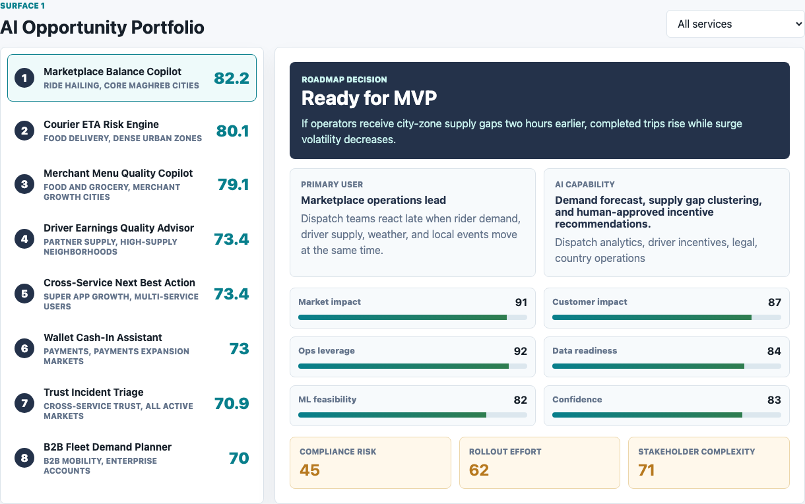
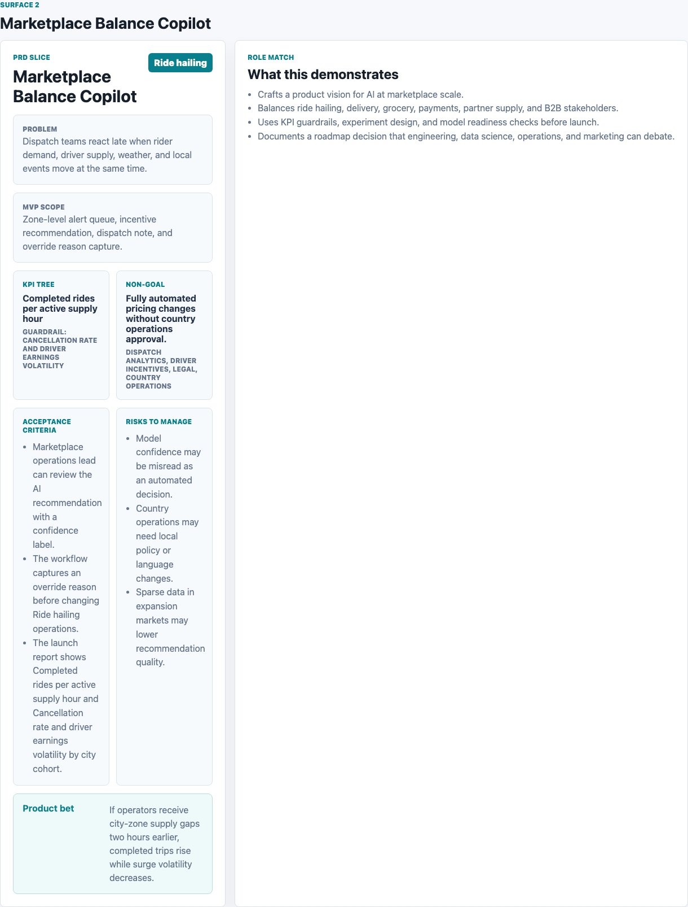
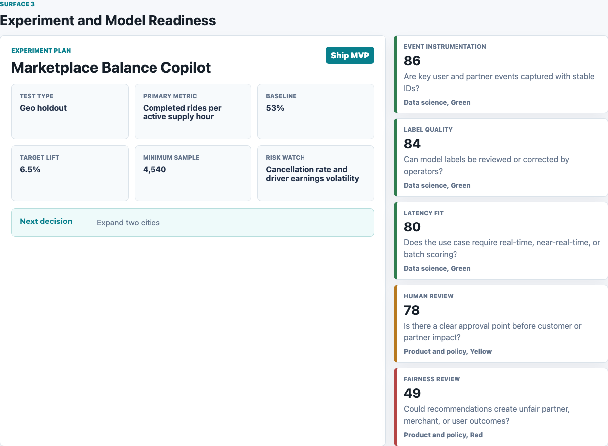

# Super App AI Marketplace Optimization Studio

An interactive AI product management artifact for a multi-service super app marketplace. It helps a product team decide which AI opportunities should move from discovery into an MVP, which should stay in a guardrailed pilot, and which need more evidence before engineering investment.

This is not a generic dashboard. It is a compact product decision studio that connects AI opportunity scoring, PRD framing, experiment design, model readiness, and stakeholder alignment across ride hailing, food delivery, grocery, wallet, partner supply, and B2B mobility.

## Screenshots



**AI Opportunity Portfolio:** Ranks AI product bets using transparent criteria for market impact, customer impact, operating leverage, data readiness, machine learning feasibility, confidence, compliance risk, rollout effort, and stakeholder complexity.



**PRD Builder:** Converts the selected AI opportunity into a product-ready PRD slice with problem statement, MVP scope, KPI tree, guardrail metric, non-goal, acceptance criteria, risks, and stakeholder dependencies.



**Experiment and Model Readiness:** Defines the launch test, primary metric, target lift, sample requirement, risk watch, and model readiness checks needed before scaling an AI feature.

## What This Demonstrates

- AI product strategy: chooses where AI should create marketplace leverage instead of adding AI for its own sake.
- Product lifecycle management: moves from discovery, to MVP definition, to experiment design, to launch governance.
- Data-driven decision-making: uses scoring, KPI trees, guardrails, and readiness checks to support roadmap tradeoffs.
- Stakeholder management: makes dependencies explicit across product, data science, operations, payments, support, policy, marketing, and country teams.
- Technical fluency: separates data readiness, machine learning feasibility, latency fit, label quality, human review, and fairness review.

## Data

All performance data is synthetic and is labeled as synthetic. The datasets are modeled on the structure of a real multi-sided on-demand marketplace, where customers, drivers, couriers, merchants, agents, enterprise accounts, and operations teams interact across multiple services and countries.

The public domain structure used for the model is a multi-service super app with ride hailing, food delivery, grocery or market ordering, wallet payments, B2B mobility, and partner networks. No private company data, customer data, partner data, revenue data, or operational data is used.

Generated source tables:

- `data/ai_opportunities.csv`: 8 AI opportunity records across marketplace balance, delivery reliability, wallet adoption, merchant catalog quality, partner earnings, B2B planning, trust operations, and cross-service growth.
- `data/prd_cards.csv`: PRD-ready product slices with problem statements, hypotheses, MVP scope, KPI trees, guardrails, non-goals, stakeholders, acceptance criteria, and launch risks.
- `data/experiment_plan.csv`: proposed experiment plans with test type, primary metric, baseline, target lift, sample size, launch gate, risk watch, and next decision.
- `data/model_readiness.csv`: readiness checks for event instrumentation, label quality, latency fit, human review, and fairness review.

Synthetic assumptions:

- Opportunity scores use 0 to 100 inputs for market impact, customer impact, operating leverage, data readiness, machine learning feasibility, confidence, compliance risk, rollout effort, and stakeholder complexity.
- Marketplace balance and delivery ETA risks receive higher operating leverage because dense city networks can benefit from earlier supply and reliability interventions.
- Wallet and trust opportunities carry higher compliance or policy risk, so they require stronger guardrails before broad rollout.
- Expansion and cross-service bets use lower confidence when data sparsity, local policy, or stakeholder complexity would slow launch.
- Experiment target lift is derived from the opportunity score, then constrained to a realistic product-test range.

## Analysis Outputs

- `analysis/outputs/opportunity_queue.csv`: ranked AI product opportunity queue.
- `analysis/outputs/prd_cards.csv`: PRD content used by the PRD Builder surface.
- `analysis/outputs/experiment_plan.csv`: launch tests and KPI guardrails.
- `analysis/outputs/model_readiness.csv`: model and data readiness checks.
- `analysis/outputs/app_payload.json`: frontend payload for the interactive studio.
- `analysis/outputs/summary.json`: executive summary metrics.
- `analysis/executive_findings.md`: concise product readout.
- `analysis/methodology.md`: scoring logic and synthetic data methodology.
- `analysis/sql_checks.sql`: SQL-style review checks.

## Scope

This artifact does:

- Show how an AI Product Manager can prioritize AI investments across a multi-service marketplace.
- Provide three distinct surfaces for roadmap prioritization, PRD definition, and launch readiness.
- Use a transparent scoring model that can be explained and challenged in an interview.
- Make product, data science, operations, and policy tradeoffs visible.

This artifact does not:

- Claim to represent real company performance.
- Include real customer, partner, revenue, safety, payment, or operational data.
- Train or deploy a production machine learning model.
- Replace a production experimentation platform, feature store, data warehouse, or policy review process.

## Run Locally

```bash
npm run analyze
npm run start
```

Then open `http://localhost:6119`.
